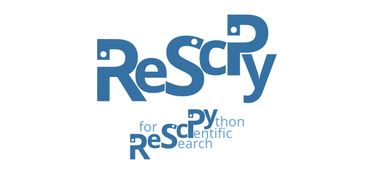

===============
reScipy project
===============

Welcome! The reScipy project is an effort aiming to provide researchers with a set of tools and documentation to perform scientific data analysis with Python more easily and efficiently.

At present the reScipy project provides:

* the `reScipy lectures <https://rescipy-lectures.readthedocs.io>`_, a collection of tutorials on Python for scientific research, under active development.

* the `reScipy package <https://rescipy.readthedocs.io>`_, a Python package integrating additional tools specific for data analysis in scientific research.

Additional packages part of the reScipy project:

* `nxarray <https://nxarray.readthedocs.io/en/latest/index.html>`_, an xarray extension for loading and saving NeXus/HDF5.

For the latest news follow `reScipy on Twitter <https://twitter.com/reScipy>`_.

Contributing
============

If you are interested in contributing to the project, check the relevant links above and give your feedback. Any comment or contribution is more than welcome!

Feedback
========

Please report any feedback on this website by opening an issue on the `issue tracker <https://github.com/rescipy-project/rescipy-website/issues>`_ of the code repository.
